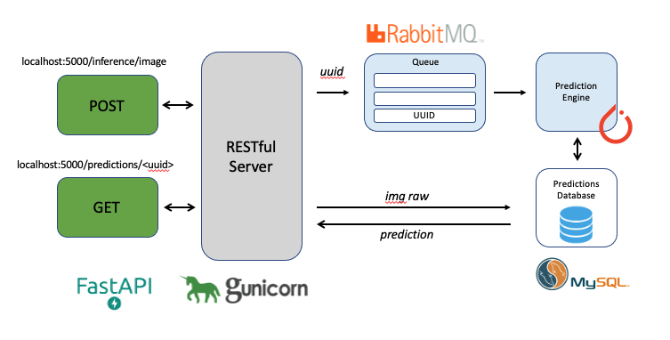

# ML Prediction System

## System Diagram

The following diagram describes the system at a high level



## System Stack Considerations

**FastAPI and Uvicorn**: 

FastAPI ia a simple, but powerful web RESTful API framework based in Python. Benchmark tests have shown it to be on-part with NodeJS and Go. It also has a simple interface, allowing for an API server to be brought up within a few lines of code. To deploy this server, Uvicorn is used to host the web application

**RabbitMQ**: 

In order to support asynchronous requests, a queue system is implemented to handle prediction requests in message-broker manner. RabbitMQ was used for this purpose, based on its simplicity and that it can easily deployed in the cloud and deployed in distrubuted environments

**MySQL**

Prediction transactions are stored in a MySQL database. Having a fixed schema, a relational database was chosen. For this service, a UUID, Image String, and Prediction result is stored. With a UUID as primary key, and prediction result requiring no additional processing, using a SQL database will result in faster data retrieval times. 

**Prediction Engine**

A Prediction Engine written in Python is used as consumer for the MQ (message queue). It operates on a call-back mechanism in order to retreive the UUID for the prediction request, 

## Operation Instructions:

The system supports asynchronous predictions. That is, the user is required to request a prediction through a POST command with their image for inference. If response is successful, they will be returned with a UUID that is unique to their prediction.

The system will process the request and upload its result to the Predictions database.
The user can retrieve their result by submitting a GET request by passing to it their UUID


**Request a Prediction:**

POST REQUEST : `localhost:5000/inference/image`

Input image must be base64 encoded and passed in to data raw as json in the following format:
```
{
    "name": "name",
    "data": "<base64encoded string>"
}
```

Example:

```
curl --location --request POST 'http://127.0.0.1:5000/inference/image/' \
--header 'Content-Type: text/plain' \
--data-raw '{
    "name": "dog",
    "data": "/9j/ ..."
    }'
    
:return: 
    {
        uuid: <uuid>
    }
```

Note: For b64 encoding, try the following command:
```
base64 image.jpg 
```

**Retreive Prediction Result:**

GET REQUEST `localhost:5000/predictions/<uuid>`

```
curl --location --request GET 'http://127.0.0.1:5000/predictions/ab2o5pd2/' 

:return: 
    {
        "predictoin": "dogsled"
    }
```

## Assumptions:

## Notes:


## Running Unit Tests: